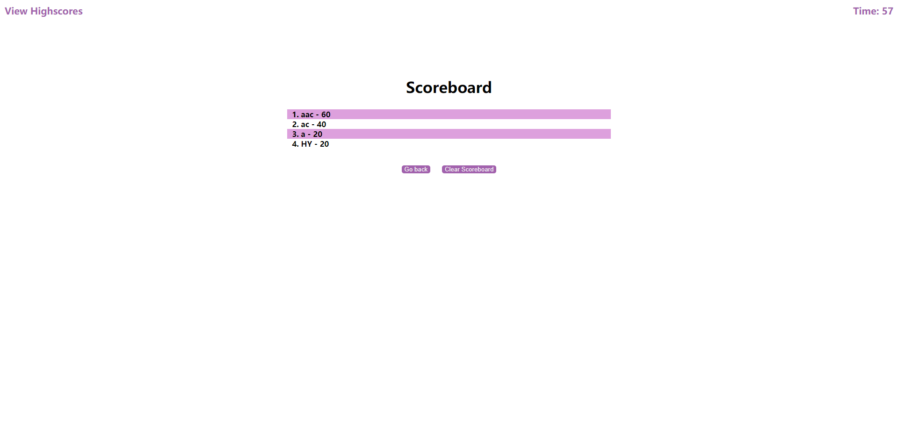

# UCSD_HW4_Code-Quiz
This is the HW 4 of bootcamp, where the homework requires to build a timed coding quiz with multiple-choice questions.

## User Story

```
AS A coding boot camp student
I WANT to take a timed quiz on JavaScript fundamentals that stores high scores
SO THAT I can gauge my progress compared to my peers
```

## Link to the Quiz.

* First of All, click to start the Quiz: [Take the Quiz!](https://hengyu89.github.io/UCSD_HW4_Code-Quiz/)


## What I've done

* At the "welcome" page, left-click the "Start Quiz" to start.

* This is the Quiz, with 5 multiple choices, and each question worth 20 points that the user will get 100 if all correct. In the library, there are 7 questions which 5 of them are randomly chosen every-time while taking the quiz.

* General the time limit is "60" seconds, if the user ran out of time, the quiz will stop and turn to the summary page immediately with the current score they earned.

* Also, if you choose a wrong answer, the time left will take 10 seconds off.

* In the summary page, you could see your score, and store it to the Scoreboard. Where you are able to see your rank list at the end. If you leave the blank empty, the name will automatically store as "anonymity". Left-Click the "Submit" button to turn to Scoreboard page.

* In the Scoreboard page, you could see all the rank with top-5 scores and their users' initials (or Name). Click the "Go Back" to start over, turn back to "Welcome" page. Click the Clear Scoreboard to remove all ranks on the Scoreboard (Empty it!)

* GLHF.

## Screenshot with 4 different pages:

### The "Welcome Page"


### The "Question Page"


## The "Summary Page"


## The "Scoreboard Page"
